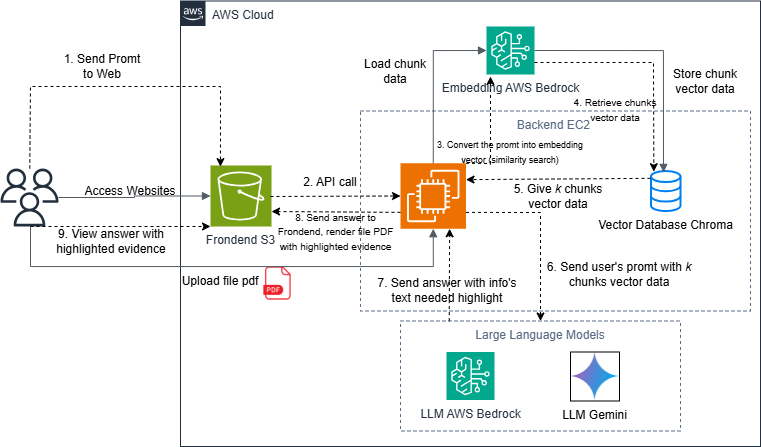

# RAG Chatbot with Evidence Highlighting Feature

## Overview
In this workshop, we will build a chatbox web application with RAG functionality along with an evidence highlighting feature directly on a PDF file. We will also explore the basics of large language models, the mechanism and principles of a RAG chatbox, and the algorithm for the evidence highlighting feature.

## Key Features

- **Web UI and API Access**: Modern React interface and API endpoints for integration
- **AWS Bedrock Integration**: Uses Claude 3.5 Sonnet for intelligent responses
- **Document Processing**: Upload and index PDF documents for knowledge base
- **Vector Database**: ChromaDB for efficient document retrieval
- **PDF Highlighting**: Automatic highlighting of relevant document sections
- **Real-time Chat**: Interactive chat interface with source references
- **Page-specific Navigation**: Jump directly to relevant pages in source documents

## Architecture

## Quick Start

### Prerequisites
- **Node.js** (v18 or higher)
- **Python** (v3.11 or higher)
- **AWS Account** with Bedrock access
- **Docker** (for backend deployment)

### Deployment

For detailed deployment instructions including Docker setup, cloud deployment, and production configuration, please refer to our workshop: [Working with Retrieval-Augmented Generation with Evidence Highlighting Feature](https://markx04.github.io/rag-chatbot-workshop/).

The workshop covers:
- **Theory**: LLM fundamentals and RAG principles
- **Deployment**: Production-ready deployment strategies

## Usage

### Uploading Documents

1. Click the "📁 Upload Documents" button
2. Select one or more PDF files
3. Wait for processing to complete
4. The status indicator will show "RAG Ready" when done

### Asking Questions

1. Type your question in the chat input
2. Press Enter or click "Send"
3. The AI will respond with relevant information from your documents
4. Click on page reference buttons to view specific document pages

### Viewing Document References

- **Page Buttons**: Click to jump to specific pages in source documents
- **PDF Viewer**: Opens on the right side when you click a page reference
- **Highlighting**: Relevant text sections are automatically highlighted

## License

This project is licensed under the MIT License - see the LICENSE file for details.

## Contributing

1. Fork the repository
2. Create a feature branch: `git checkout -b feature/amazing-feature`
3. Commit your changes: `git commit -m 'Add amazing feature'`
4. Push to the branch: `git push origin feature/amazing-feature`
5. Open a Pull Request

---
